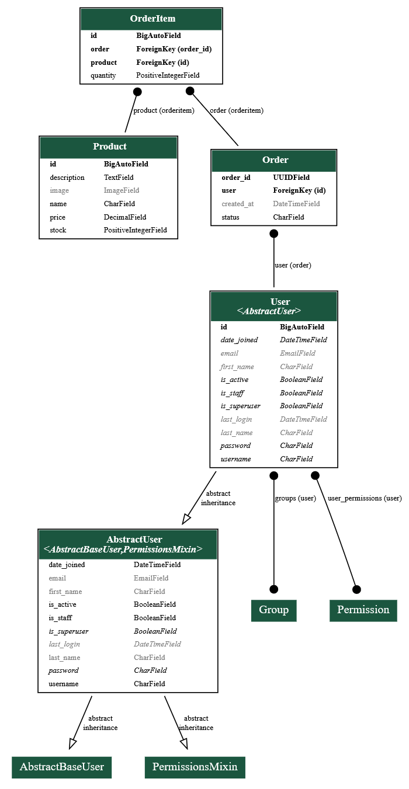

# Diagram for the database looks like this



# We are using django-silk package to view the query request analytics 

analytics view page 
```bash
localhost:8000/silk/
```

in another tab you should make a request to your actual endpoint 
